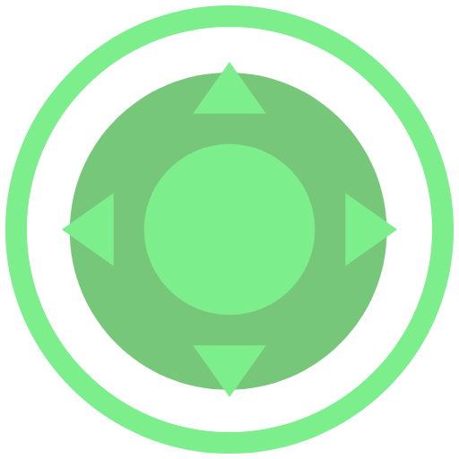

# Virtual Joystick DX
<br>
<div align="center">
 
 </div>
 <br>

** Virtual Joystick DX (v0.3a) **

A fully customizable virtual joystick for touchscreen mobile games. Switch between a smooth **360° analog joystick** and an **8-direction D-Pad**.

**Compatible with Godot 4.3+ — tested on 4.7**

---

## Usage

1. Copy `addons/virtual_joystick_DX/` into your project's `addons/` folder.
2. **Project → Project Settings → Plugins** → enable **Virtual Joystick DX**.
3. Add the `VirtualJoystickDX` node to a `CanvasLayer`.

---

## Player Script

```gdscript
func _physics_process(_delta: float) -> void:
    var dir := Vector2(
        Input.get_axis("move_left", "move_right"),
        Input.get_axis("move_up",   "move_down")
    )
    velocity = dir * speed
    move_and_slide()
```

> Use `get_axis()`, **not** `get_vector()`. `get_vector()` applies an internal deadzone that truncates analog values and breaks smooth movement.

---

## Inspector Reference

The Inspector hides parameters that don't apply to the selected style. All hidden values are still saved.

---

## Controller Settings
### Controller Style

| Property | Default | Description |
|---|---|---|
| `controller_style` | `JOYSTICK` | `JOYSTICK` — smooth 360°. `DPAD` — 8-direction cross. |

---

| Property | Mode | Default | Description |
|---|---|---|---|
| `joystick_radius` | Joystick | `80 px` | Base radius. Also sets the node's minimum size. |
| `thumb_radius` | Joystick | `28 px` | Knob radius. Sets the deadzone maximum. |
| `dpad_radius` | D-Pad | `80 px` | D-Pad base radius. |
| `deadzone` | Both | `0.15` | Dead area as a fraction of the radius. Max = `thumb_radius / joystick_radius` (Joystick) or `0.9` (D-Pad). Set to `0` for constant speed from any position. |
| `debug_deadzone` | Both | `true` | Filled circle overlay showing the deadzone boundary, drawn on top. Editor only. |
| `debug_deadzone_color` | Both | red | Color of the deadzone overlay. |
| `clampzone_ratio` | Joystick + Dynamic/Following | `1.5` | Distance multiplier (×`joystick_radius`) from the clamped base center before auto-release. Range `1.0–3.0`. |
| `debug_clampzone` | Joystick + Dynamic/Following | `false` | Circle overlay showing the auto-release boundary. Editor only. |
| `clampzone_color` | Joystick + Dynamic/Following | yellow | Color of the clampzone overlay. |

### Deadzone

The maximum allowed `deadzone` is `thumb_radius / joystick_radius`. At maximum deadzone, the dead area is exactly as large as the thumb, so the knob resting at center is already at the boundary. The slider max updates in real time when either radius changes.

### Joystick Mode
| Mode | Activates on touch... | Once active |
|---|---|---|
| `STATIC` | anywhere in the active region | base never moves |
| `DYNAMIC` | anywhere in the active region | base teleports to the touch point, then slides to follow the finger |
| `FOLLOWING` | only directly on the joystick itself — touches elsewhere in the active region do nothing | base stays put until the finger exceeds `joystick_radius`, then follows exactly like `DYNAMIC` |

`DYNAMIC` and `FOLLOWING` share the same follow mechanic (slide, clamp, auto-release) — they only differ in how the control gets activated. Both return to their origin position on release.

### Settings — Input Mapping

Each field is a dropdown showing all built-in and project-defined actions, but also accepts free text — type any action name directly.

| Property | Default |
|---|---|
| `action_left` | `ui_left` |
| `action_right` | `ui_right` |
| `action_up` | `ui_up` |
| `action_down` | `ui_down` |

### Dynamic Visibility (Hardware detection)

| Property | Type | Default | Description |
|---|---|---|---|
| `auto_hide_on_physical_input` | bool | `true` | Hides the control when a gamepad connects, a physical key is pressed, or the physical gamepad stick or buttons are actively used. |
| `auto_show_on_touch` | bool | `true` | Re-shows the control when the screen is touched, even if a gamepad is still connected. Once visible again, any gamepad input will hide it once more. Only has effect when `auto_hide_on_physical_input` is also enabled. |

### Active Region
| Property | Default | Description |
|---|---|---|
| `use_active_region` | `true` | Limits touch detection to a custom screen area. |
| `region_x / y` | `0` | Top-left corner of the region in viewport pixels. Slider max = viewport size. |
| `region_w / h` | `648` | Size of the region. Clamped so it never exits the viewport. |
| `debug_show_region` | `true` | Green overlay visible in the editor only. |
| `debug_region_color` | green | Color of the region overlay. |

In **Static / D-Pad** mode the control auto-releases if the finger leaves the region during a drag. In **Dynamic / Following** mode the base clamps to the region boundary instead. Note: the active region only gates *activation* for `STATIC`/`DYNAMIC` — `FOLLOWING` ignores it for activation and always requires touching the joystick directly.

### Colors (fallback when no texture is set)
**Joystick:** `color_js_base` `color_js_border` `color_js_thumb` `color_js_thumb_active`

**D-Pad:** `color_dp_bg` `color_dp_border` `color_dp_normal` `color_dp_active` `color_dp_arrow`

### Textures — Joystick *(Joystick only)*
| Property | Size |
|---|---|
| `tex_joystick_base` | `joystick_radius × 2` sq. |
| `tex_joystick_thumb` | `thumb_radius × 2` sq. |
| `tex_joystick_thumb_pressed` | `thumb_radius × 2` sq. |

### Textures — D-Pad *(D-Pad only)*

| Property | Default | Description |
|---|---|---|
| `dpad_use_textures` | `true` | ON → uses preset textures by default, custom slots override per state. OFF → always uses code-drawn fallback. |
| `dpad_preset` | `PRESET_1` | `PRESET_1` or `PRESET_2`. Active when no custom texture is set for a slot. |

**Custom texture slots** (visible when `dpad_use_textures` is ON):

| Slot | Description |
|---|---|
| `tex_dpad_idle` | No direction pressed. Also the fallback for unassigned states. |
| `tex_dpad_up/down/left/right` | Cardinal directions. |
| `tex_dpad_up_right/up_left/down_right/down_left` | Diagonal combinations. |

All textures should be `dpad_radius × 2` on each axis. Preset SVGs are in `addons/virtual_joystick_DX/Dpad textures/preset 1(2)/`.

**Texture priority:** custom slot → preset → code drawing.

---

## Signals

```gdscript
joystick_moved(direction: Vector2)       # every frame while active
joystick_released()                      # on release
hardware_visibility_changed(is_visible: bool)
```

---

## Dual Joystick Setup

```gdscript
func _ready() -> void:
    var vp := get_viewport().get_visible_rect().size
    $JoyLeft.use_active_region  = true
    $JoyLeft.region_w           = vp.x / 2.0
    $JoyLeft.region_h           = vp.y
    $JoyRight.use_active_region = true
    $JoyRight.region_x          = vp.x / 2.0
    $JoyRight.region_w          = vp.x / 2.0
    $JoyRight.region_h          = vp.y
```

---

## Troubleshooting

| Problem | Fix |
|---|---|
| No response to touch | Check visibility and active region. Enable `debug_show_region`. |
| Actions not detected | Verify action names exist in **Project Settings → Input Map**. |
| Only 8 directions | Use `get_axis()`, not `get_vector()`. |
| Inconsistent speed | Same — switch to `get_axis()`. |
| Hides unexpectedly | Intended: `auto_hide_on_physical_input` detected hardware input. Touch the screen to restore. |
| Deadzone slider max too small | Increase `thumb_radius` or decrease `joystick_radius`. |
| Region sliders don't reach full screen | Reselect the node to refresh slider ranges. |
| D-Pad shows no texture | Verify `dpad_use_textures` is ON and preset SVGs are in the correct folder path. |
| Dynamic / Following mode on D-Pad | Not supported — D-Pad is always Static. |
| Following does nothing on touch | Intended: `FOLLOWING` only activates on a direct touch of the joystick itself, not anywhere in the active region. |

---